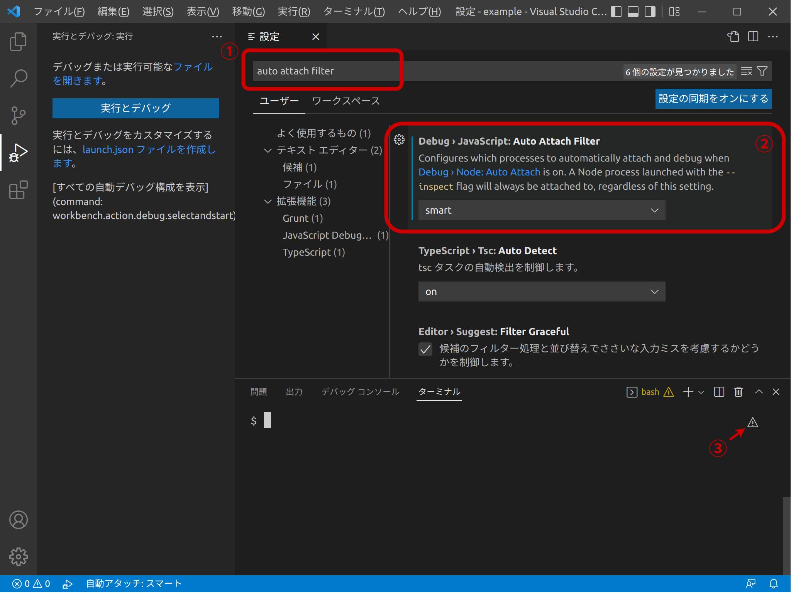
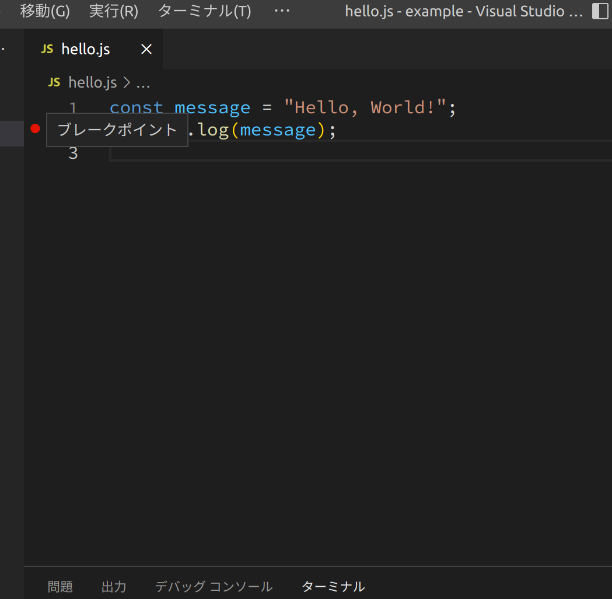
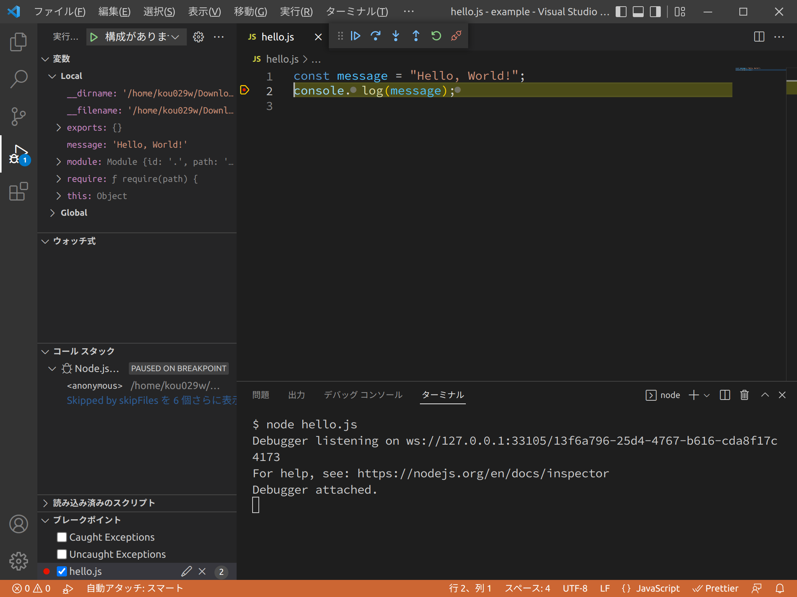

# VSCodeでのNode.jsのデバッグ

VSCodeは標準でNode.jsのプログラムのデバッグを行うことができます。

VSCodeでNode.jsのプログラムのデバッグを行うには、Auto Attach (自動アタッチ)を使用します。
設定を変更し、Node.jsで起動したプログラムにアタッチして、デバッグを開始します。

デバッグを行えるようにすることで、ブレークポイントを指定して処理の流れを確認したり、そのときの変数の内容を確認したりすることができます。

## 自動アタッチ設定

設定から、Debug › JavaScript: Auto Attach Filter (`debug.javascript.autoAttachFilter`) を変更します (1)。

`smart` を選択すると、VSCodeターミナルからNode.jsのプロセスを実行したとき[`--inspect`](https://nodejs.org/en/learn/getting-started/debugging)スイッチが有効化され、自動的にデバッグを開始することができます (2)。

自動アタッチを行うにはVSCode内のターミナルを使用しなければなりません。
また、Auto Attachを有効にした後、ターミナルを一度再起動する必要があります。これは、ターミナルの右上にある ⚠ アイコンをクリックするか、新しいターミナルを作成することで行えます (3)。



_自動アタッチの設定_

## ブレークポイント

Node.jsで実行するプログラムのコードをVSCodeで開き、行番号の左の部分をクリックしてブレークポイントを作成できます。
また、もう一度その部分をクリックすることでそのブレークポイントを削除できます。



_ブレークポイントの作成_

あるいは、画面上からクリックする代わりに、コードのブレークポイントを置きたい場所に `debugger` 文を追加することでブレークポイントを作成します。いずれの方法でもブレークポイントを作成できます。

参考文献: [debugger - JavaScript | MDN](https://developer.mozilla.org/ja/docs/Web/JavaScript/Reference/Statements/debugger)

ブレークポイントを作成後、VSCode内のターミナルから実行するとそのブレークポイントでNode.jsの処理は一時停止します。

ターミナル:

```console
$ node hello.js
```



_Node.jsのデバッグ_

上部に表示されているボタンの意味を説明します。

### 続行

<!-- @license https://github.com/microsoft/vscode/raw/1.84.1/LICENSE.txt -->

プログラムの実行を続けます。プログラムが終了するか次にブレークポイントが現れるまで実行し続けます。

### ステップオーバー

<!-- @license https://github.com/microsoft/vscode/raw/1.84.1/LICENSE.txt -->

ステップオーバー、ステップイン、ステップアウトはステップ実行のための機能です。

ステップオーバーは、プログラムを1行進めます。

### ステップイン

<!-- @license https://github.com/microsoft/vscode/raw/1.84.1/LICENSE.txt -->

ステップインは、もしその行に関数の呼び出しがあれば、その関数の最初の行に移動します。

### ステップアウト

<!-- @license https://github.com/microsoft/vscode/raw/1.84.1/LICENSE.txt -->

ステップアウトは、もしその行が関数の中であれば、その関数の呼び出し元の次の行に移動します。

参考文献: [Debugging in Visual Studio Code](https://code.visualstudio.com/docs/editor/debugging)

このようにして、VSCodeでNode.jsのプログラムのデバッグを行うことができます。
