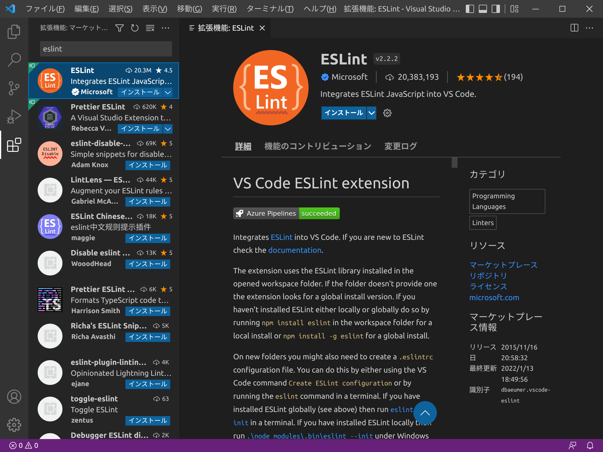
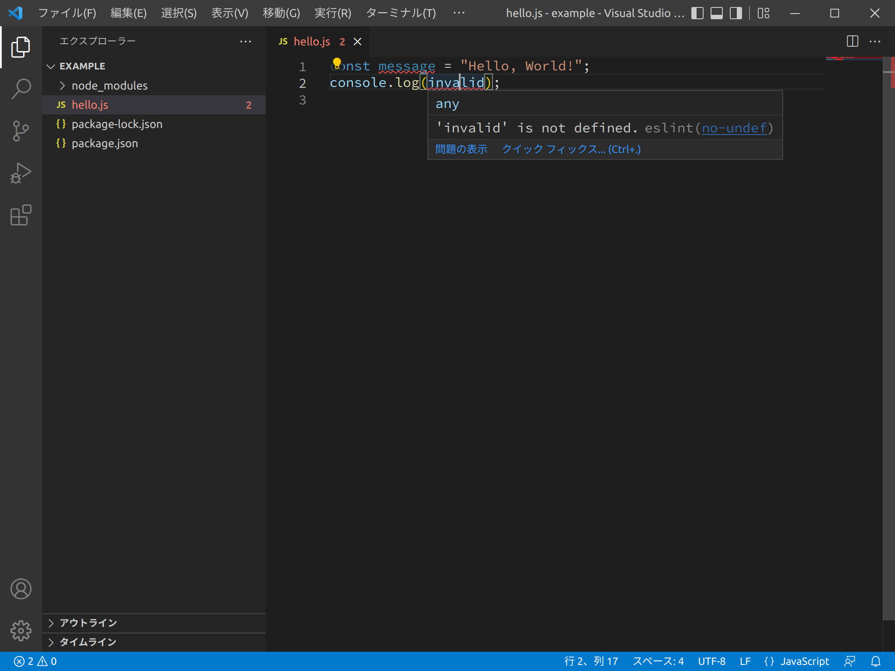
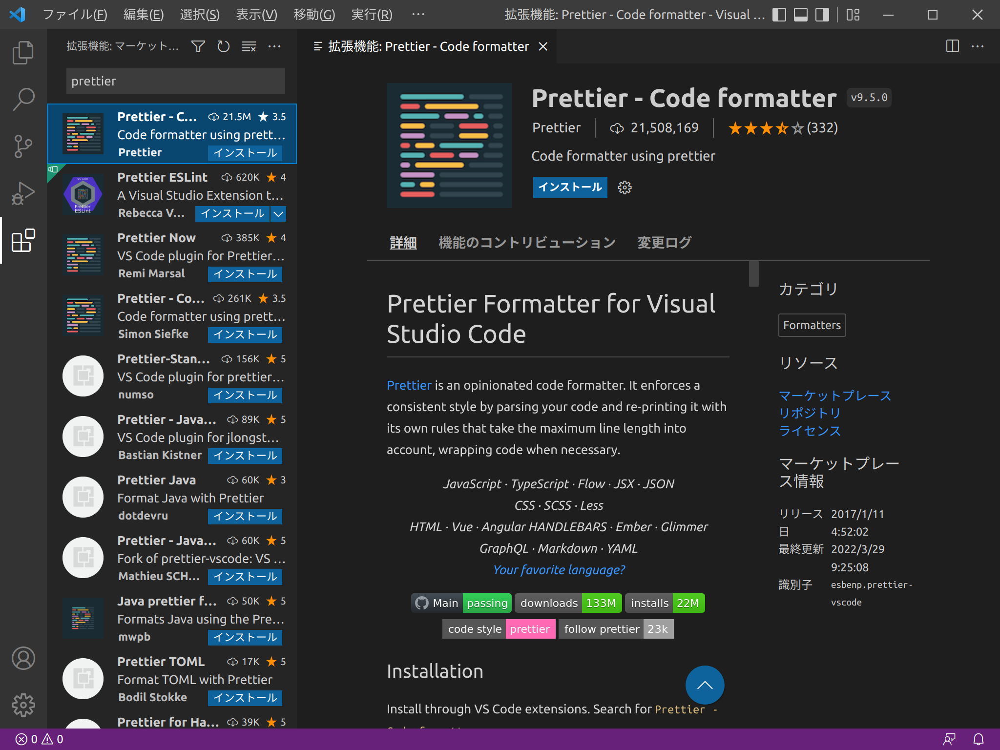
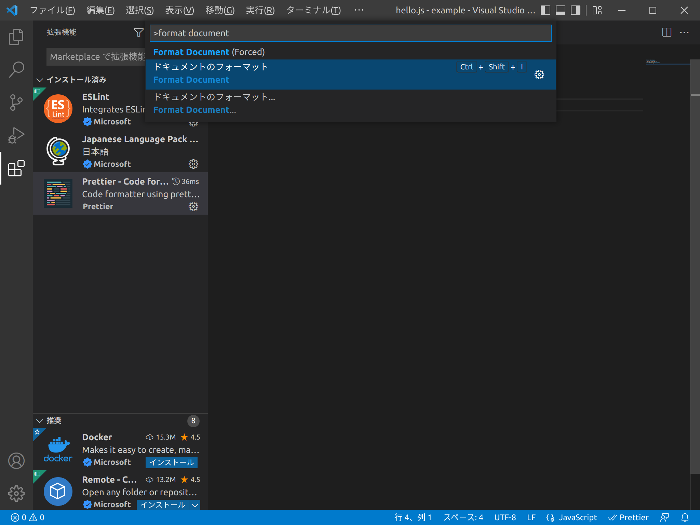
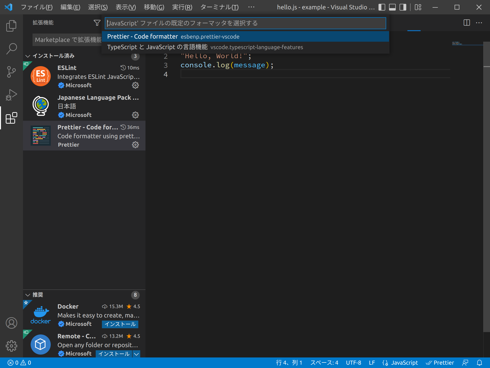
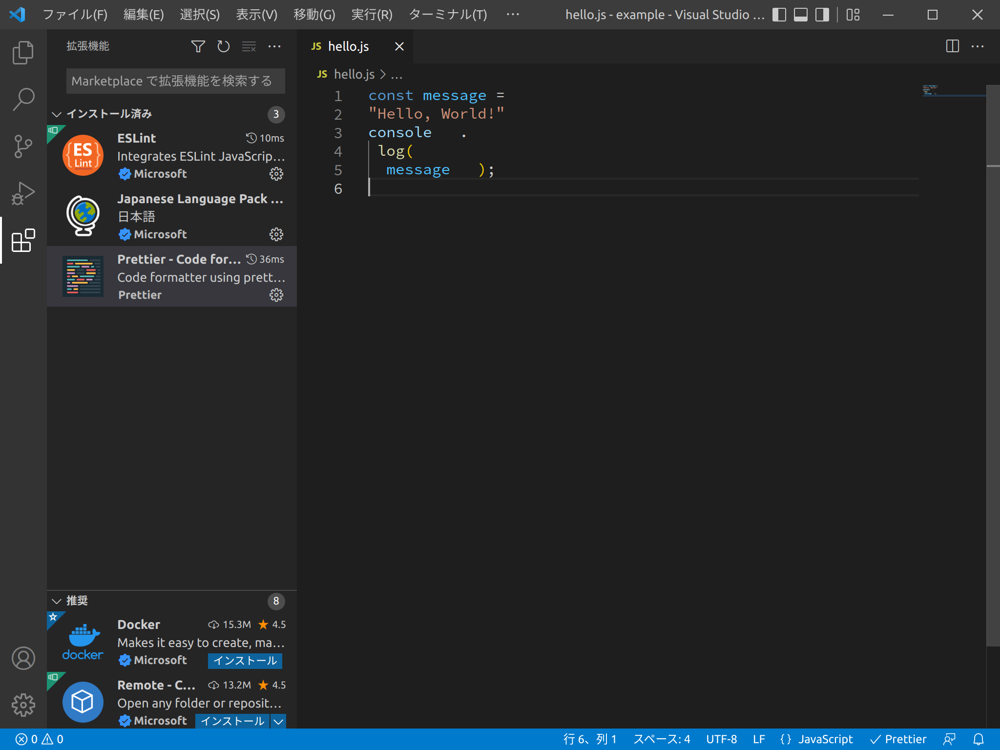
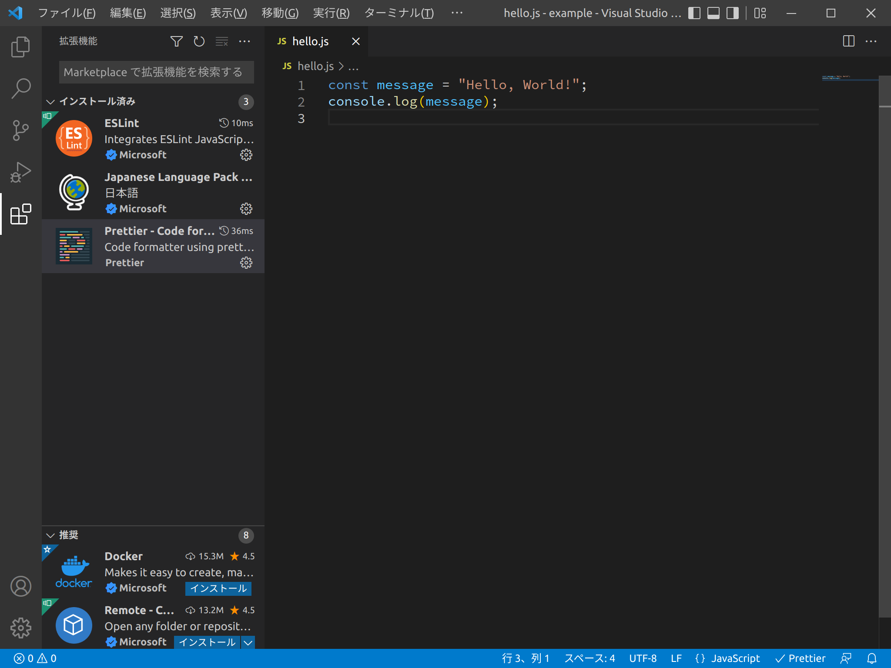
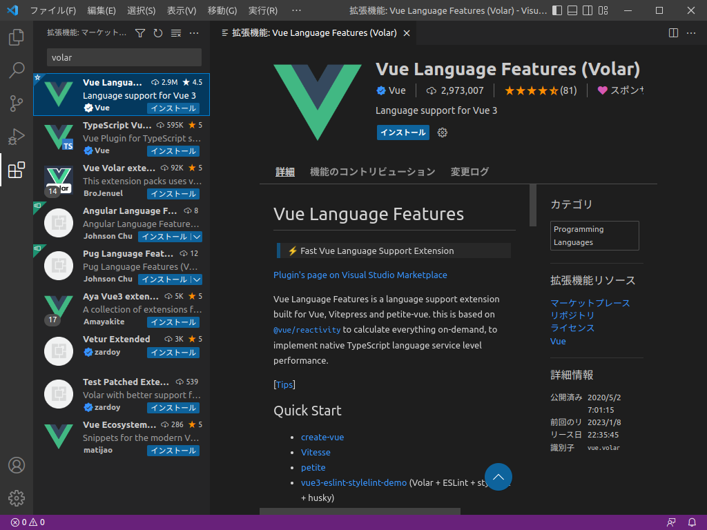

# VSCodeの拡張機能

VSCodeは、標準で備えている機能の他にMarketplaceにある拡張機能をインストールすることでさまざまな機能を追加することができます。

## 拡張機能の検索

VSCodeを起動して、ウィンドウの左端のアクティビティバーにある「拡張機能」をクリックして、Marketplaceにある拡張機能を検索することができます。



_ESLintのインストール_

## 便利な拡張機能の紹介

- ESLint ([`dbaeumer.vscode-eslint`](https://marketplace.visualstudio.com/items?itemName=dbaeumer.vscode-eslint)) … ESLintを使用するための拡張機能
- Prettier - Code formatter ([`esbenp.prettier-vscode`](https://marketplace.visualstudio.com/items?itemName=esbenp.prettier-vscode)) … Prettierを使用するための拡張機能
- Vue Language Features (Volar) ([`Vue.volar`](https://marketplace.visualstudio.com/items?itemName=Vue.volar)) … Vue.jsを使用するための拡張機能

検索した拡張機能を選択し、Install (インストール)をクリックしてその拡張機能をインストールします。

## ESLintの使用

「eslint」などのキーワードで検索し、拡張機能をインストールします。

[ESLintの導入](eslint.md)のように、あらかじめESLintを導入したプロジェクトをVSCodeから開くと、そのプロジェクトのESLintが自動的に実行され、VSCodeの編集画面に表示されます。



_ESLintの使用_

このようにESLintの拡張機能をインストールすることによって自動的にESLintを実行し、即時にJavaScriptのコードのチェックを行うことができます。

## Prettierの使用

[Prettierの導入](prettier.md)で説明したとおり、PrettierはJavaScriptをはじめとしたさまざまなコードを整形するためのツールです。

Prettierの拡張機能をインストールすることによって、VSCodeの編集画面に表示されるコードを自動的に整形することができます。
Marketplaceに「Prettier - Code formatter」という名前で提供されています。これをインストールします。



_Prettier_

インストール後、ファイルを開き、`Ctrl`+`Shift`+`P` (macOSの場合は`Cmd`+`Shift`+`P`)を押して、コマンドパレットを開きます。そのなかに

```
> format document
```

等のキーワードで「ドキュメントのフォーマット (Format Document)」を選択して、フォーマットを実行します。あるいは、`Ctrl`+`Shift`+`I` (macOSの場合は`Cmd`+`Shift`+`I`)を押しても、同様の操作が可能です。いずれかを実行してコードの整形を行います。



初回フォーマット時に、フォーマッタの選択肢が表示されることがあります。ここでフォーマッタとして、さきほどインストールした「Prettier - Code formatter (`esbenp.prettier-vscode`)」を選択します。



こうすることによって規定のフォーマッタとしてPrettierが設定されます。それでは実際にPrettierによるコードの整形を試していきましょう。

例として、空白と改行がぐちゃくちゃに挿入されたJavaScriptのコードを示します。



このコードに対して「ドキュメントのフォーマット」実行すると、次のように整形されます。



さらに[VSCodeの便利な設定](installing-vscode.html#%E4%BE%BF%E5%88%A9%E3%81%AA%E8%A8%AD%E5%AE%9A)のなかで紹介した「Format On Save」を有効にすることで自動整形を行うことができます。

このようにして、Prettierによって簡単にコードを整形できます。

## Vue Language Features (Volar)の使用

VolarはVueの公式のVSCode拡張機能です。



_Volar_

こちらも必要に応じて使いましょう。
